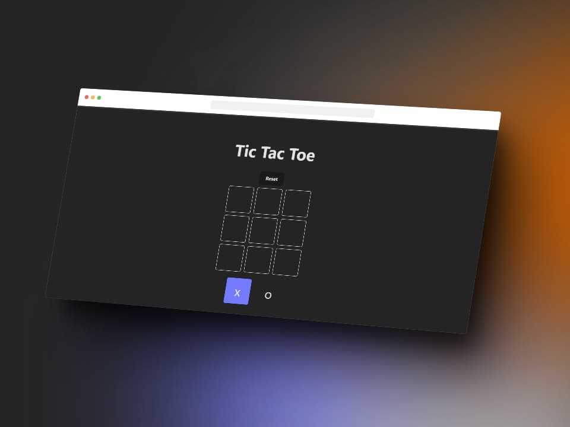

# Juego de Tic Tac Toe en React

Este es un simple juego de Tic Tac Toe desarrollado en React. ¡Diviértete jugando con un amigo!



## Demo

Puedes probar una demostración en vivo del juego [aquí](#).

## Instalación

Para ejecutar este proyecto en tu máquina local, sigue estos pasos:

1. Clona este repositorio:

```bash
git clone https://github.com/wolfsoul01/tic-tac-toe.git
